# 🏥 Medical AI Hospital Portal

**Frontend (Next.js) + Gateway API (FastAPI) + MCP Server + Postgres**

<p align="left">
  
  
  
  
  
  <a href="LICENSE"></a>
</p>

> A production-ready hospital portal where patients can **register/login**, chat with an AI intake assistant (Watsonx Orchestrate / MCP), and **manage their medical profile**. The stack wires a **Next.js** frontend to a **FastAPI** gateway that talks to **Postgres** and the external **medical-mcp-toolkit** server (HTTP + SSE).


---

## Table of Contents

- [🏥 Medical AI Hospital Portal](#-medical-ai-hospital-portal)
  - [Table of Contents](#table-of-contents)
  - [🧠 System Architecture](#-system-architecture)
  - [✨ Features](#-features)
  - [🧰 Tech Stack](#-tech-stack)
  - [📋 Prerequisites](#-prerequisites)
  - [🚀 Quickstart](#-quickstart)
    - [A) Run everything with Docker Compose](#a-run-everything-with-docker-compose)
    - [B) Run services manually (dev)](#b-run-services-manually-dev)
  - [⚙️ Configuration](#️-configuration)
  - [🧩 Services](#-services)
    - [Database](#database)
    - [MCP Server](#mcp-server)
    - [Gateway API](#gateway-api)
    - [Frontend](#frontend)
  - [🛠️ CLI, Make \& Scripts](#️-cli-make--scripts)
  - [✅ Health \& Smoke Tests](#-health--smoke-tests)
  - [🔒 Security \& Compliance](#-security--compliance)
  - [🌐 Production Deployment](#-production-deployment)
  - [🧯 Troubleshooting](#-troubleshooting)
  - [🤝 Contributing](#-contributing)
  - [📜 License](#-license)
    - [Acknowledgments](#acknowledgments)

---

## 🧠 System Architecture

```mermaid
flowchart TD
    %% --- Diagram Title ---
    %% title Detailed Application Architecture

    %% --- Style Definitions ---
    classDef client fill:#D6EAF8,stroke:#3498DB,stroke-width:2px;
    classDef gateway fill:#E8F8F5,stroke:#1ABC9C,stroke-width:2px;
    classDef services fill:#FEF9E7,stroke:#F1C40F,stroke-width:2px;
    classDef database fill:#FDEDEC,stroke:#E74C3C,stroke-width:2px;
    classDef ai_engine fill:#F4ECF7,stroke:#8E44AD,stroke-width:2px;

    %% --- Layer 1: Client Application ---
    subgraph FE["📱 Client Application"]
        direction LR
        AuthViews["Authentication</br>(/login, /register)"]
        ProfileViews["Patient Portal</br>(/dashboard, /profile)"]
        ChatView["AI Symptom Chat</br>(/chat)"]
    end
    class FE client;

    %% --- Layer 2: API Gateway ---
    subgraph GW["☁️ API Gateway"]
        direction TB
        subgraph AuthEndpoints["Authentication Service"]
            direction LR
            A1["POST /auth/register"]
            A2["POST /auth/login"]
        end
        subgraph ProfileEndpoints["Profile Service"]
            direction LR
            M1["GET/PUT /me"]
            M2["GET/PUT /me/patient"]
        end
        subgraph ChatEndpoints["Chat Service"]
            direction LR
            CH1["POST /chat/send"]
            CH2["GET /chat/events"]
        end
    end
    class GW gateway;

    %% --- Layer 3: Backend Services ---
    subgraph Backend["⚙️ Backend Services"]
        direction LR
        subgraph MCP["🧠 MCP Server (AI Engine)"]
            T1["triageSymptoms"]
            T2["getPatientData"]
            T3["calcClinicalScores"]
        end
        class MCP ai_engine;

        subgraph DB["🗄️ PostgreSQL Database"]
            subgraph UserData["User & Auth Tables"]
                direction TB
                U["users"]
                S["auth_sessions"]
            end
            subgraph PatientData["Patient Clinical Data"]
                direction TB
                PT["patients"]
                VT["vitals"]
                CD["conditions"]
                MD["medications"]
            end
        end
        class DB database;
    end
    class Backend services;

    %% --- Define Flows ---
    %% Client -> Gateway
    AuthViews -- "HTTPS" --> AuthEndpoints;
    ProfileViews -- "HTTPS" --> ProfileEndpoints;
    ChatView -- "HTTPS/SSE" --> ChatEndpoints;

    %% Gateway -> Backend Services
    AuthEndpoints -- "Manages" --> UserData;
    ProfileEndpoints -- "Reads/Writes" --> PatientData;
    ChatEndpoints -- "Processes symptoms via" --> MCP;

    %% Internal Backend Flow
    MCP -- "Retrieves data from" --> PatientData;
```



**Data flow highlights**

* **Auth & Identity**: `users`, `auth_sessions`, `user_roles`, `patient_users`.
* **Clinical**: `patients`, `vitals`, `conditions`, `allergies`, `medications`, `appointments`; views `v_latest_vitals`, `v_patient_profile`.
* **AI tools**: MCP HTTP + SSE. Gateway **proxies SSE** and persists updates/audit to DB.

---

## ✨ Features

* Secure **registration/login** with Argon2id hashing and opaque cookie sessions
* Patient **profile management** (demographics, contact, address) and clinical snapshot view
* **AI intake chat** with SSE streaming through the gateway (no MCP token in the browser)
* **PostgreSQL** schema optimized for medical data (vitals, meds, conditions, appointments)
* Production-minded: CORS allowlist, HttpOnly cookies, request-id middleware, structured logging

---

## 🧰 Tech Stack

* **Frontend**: Next.js 14 (App Router), React 18, TailwindCSS, TanStack Query, Zod, React Hook Form
* **Gateway**: FastAPI, Pydantic v2, httpx, psycopg v3, Argon2 (argon2-cffi)
* **AI**: MCP server (medical-mcp-toolkit) over HTTP/SSE
* **Database**: PostgreSQL 14+ with productionized schema and views
* **Tooling**: `uv` for Python envs, Docker Compose for orchestration

---

## 📋 Prerequisites

* Docker & Docker Compose v2
* Node.js 18+
* Python 3.11+ (for local gateway dev)

---

## 🚀 Quickstart

### A) Run everything with Docker Compose

```bash
# 1) Clone and (optionally) pull MCP submodule
git clone https://github.com/<your-org>/medical-ai-hospital.git
cd medical-ai-hospital
# If using submodule layout for MCP
# git submodule update --init --recursive

# 2) Configure envs
cp gateway/.env.example gateway/.env
# Set DATABASE_URL (for compose, leave: postgresql://mcp_user:mcp_password@db:5432/medical_db)
# Set COOKIE_SECRET and MCP_BEARER_TOKEN

cp frontend/.env.local.example frontend/.env.local
# Set NEXT_PUBLIC_API_BASE=http://localhost:8080

# 3) Up!
docker compose up -d --build

# Frontend  http://localhost:3000
# Gateway   http://localhost:8080/health
# MCP       http://localhost:9090 (health endpoint if exposed)
```

### B) Run services manually (dev)

**Database**

```bash
./scripts/create_db.sh
./scripts/db_schema_check.sh
```

**MCP server** (external repo under `mcp/`)

```bash
cd mcp
cp .env.example .env           # set BEARER_TOKEN
uv run uvicorn server:app --host 0.0.0.0 --port 9090
```

**Gateway API**

```bash
cd gateway
cp .env.example .env           # set DATABASE_URL, MCP_BASE_URL, MCP_BEARER_TOKEN, COOKIE_SECRET
uv sync
uv run uvicorn app.main:app --host 0.0.0.0 --port 8080
```

**Frontend**

```bash
cd frontend
cp .env.local.example .env.local
npm ci
npm run dev   # or: npm run build && npm run start
```

---

## ⚙️ Configuration

**Gateway `.env`** (see `gateway/.env.example`):

```ini
# Core
ENV=dev
LOG_LEVEL=INFO

# DB
DATABASE_URL=postgresql://mcp_user:mcp_password@db:5432/medical_db
DB_POOL_MIN=1
DB_POOL_MAX=10
DB_TIMEOUT_SEC=10

# CORS / Frontend
ALLOWED_ORIGINS=http://localhost:3000
ALLOW_CREDENTIALS=true

# Sessions (cookie-based)
SESSION_COOKIE_NAME=sid
SESSION_TTL_SECONDS=2592000
SESSION_SECURE_COOKIES=false   # set true behind HTTPS
SESSION_SAMESITE=lax
COOKIE_SECRET=change-me-please-32B-minimum

# MCP
MCP_BASE_URL=http://mcp:9090
MCP_BEARER_TOKEN=dev-token
MCP_CONNECT_TIMEOUT=10
MCP_READ_TIMEOUT=120
```

**Frontend `.env.local`**:

```ini
NEXT_PUBLIC_APP_NAME=Medical AI Portal
NEXT_PUBLIC_API_BASE=http://localhost:8080
```

> **Security**: In production, enforce HTTPS and set `SESSION_SECURE_COOKIES=true` and `SESSION_SAMESITE=strict` (or `none` only if truly cross-site with HTTPS).

---

## 🧩 Services

### Database

* Schema derived from `medical-mcp-toolkit/db/10_init.sql`, provided here as `db/01_init.sql` for Compose initialization.
* Clinical tables: `patients`, `vitals`, `conditions`, `allergies`, `medications`, `appointments`.
* Auth tables: `users`, `auth_sessions`, `user_roles`, `password_resets`.
* Views: `v_latest_vitals`, `v_patient_profile`.
* All tables have `updated_at` triggers; use parameterized queries.

### MCP Server

* External dependency: **medical-mcp-toolkit** (HTTP shim + SSE; various clinical tools like `triageSymptoms`, `drug*`, etc.).
* Gateway talks to MCP using a **Bearer token**; the browser never sees this token.

### Gateway API

* FastAPI application encapsulating:

  * **Auth**: `/auth/register`, `/auth/login`, `/auth/logout`, `/auth/me`
  * **Me**: `/me/patient` (GET/PUT)
  * **Chat**: `/chat/send`, `/chat/events` (SSE proxy)
* Passwords hashed with **Argon2id**; sessions are **opaque cookies** with hashed tokens stored in DB.
* DB via psycopg v3 pool; HTTP/SSE via httpx; telemetry adds `X-Request-ID`.

**Cookie model**

* HttpOnly + `SameSite` and `Secure` flags set according to environment.
* Frontend uses `fetch(..., { credentials: 'include' })` to send cookies.

### Frontend

* Next.js 14 (App Router) with routes: `/register`, `/login`, `/dashboard`, `/profile`, `/chat`.
* TanStack Query for data fetching; forms with React Hook Form + Zod; Tailwind for UI.
* SSE chat client connects to `/chat/events` via EventSource (credentials included).

---

## 🛠️ CLI, Make & Scripts

Common operations are wrapped in the repo **Makefile** and shell scripts:

* `docker compose up -d --build` — bring up DB, MCP, Gateway, Frontend
* `./scripts/create_db.sh` — build/run local Postgres with init SQL
* `./scripts/db_schema_check.sh` — inspect schema, enums, row counts
* `./scripts/health.sh` — end-to-end smoke: register → login → me → profile → chat

> See `docs/INSTALLATION.md` for detailed instructions and `docs/API.md` for endpoint specs.

---

## ✅ Health & Smoke Tests

Minimal e2e via the provided script:

```bash
./scripts/health.sh
```

Manual checks:

```bash
# Gateway health
curl -sS http://localhost:8080/health | jq

# Register
curl -sS -X POST http://localhost:8080/auth/register \
  -H 'Content-Type: application/json' \
  -d '{"email":"demo@example.com","password":"Str0ng!Passw0rd"}'

# Login (keep cookies)
curl -i -c cookies.txt -b cookies.txt -sS -X POST http://localhost:8080/auth/login \
  -H 'Content-Type: application/json' \
  -d '{"email":"demo@example.com","password":"Str0ng!Passw0rd"}'

# Me
curl -sS -c cookies.txt -b cookies.txt http://localhost:8080/auth/me | jq
```

---

## 🔒 Security & Compliance

* **Transport**: HTTPS-only in production; enable HSTS at ingress.
* **Cookies**: `Secure`, `HttpOnly`, `SameSite=strict` (or `none` for cross-site + HTTPS).
* **Secrets**: Use a vault/KMS; rotate `COOKIE_SECRET`, `MCP_BEARER_TOKEN` regularly.
* **RBAC**: Extend `roles` and `user_roles` for clinicians/admins as needed.
* **Auditability**: `tool_audit` table for MCP calls; add request logging and correlation IDs.
* **PII/PHI**: Ensure encryption at rest (DB storage) and in transit; restrict DB backups.

---

## 🌐 Production Deployment

* **Compose**: Suitable for single-node or staging environments.
* **Kubernetes**: Separate Deployments (frontend, gateway, mcp) + StatefulSet (db) with managed Postgres if possible. Ingress for TLS termination and CORS control.
* **Migrations**: Adopt Alembic; store revisions under `db/migrations/`.
* **Backups**: Daily snapshots + PITR for Postgres; test restores.
* **Observability**: Structured logs, metrics, traces; centralize with your APM.

---

## 🧯 Troubleshooting

| Symptom                          | Likely Cause                       | Fix                                                                             |
| -------------------------------- | ---------------------------------- | ------------------------------------------------------------------------------- |
| `401 Unauthorized` on `/auth/me` | Cookie not sent or session expired | Ensure frontend uses `credentials: 'include'`; check cookie flags and domain.   |
| CORS error in browser            | Origin not allowlisted             | Set `ALLOWED_ORIGINS` in gateway to exact FE origin.                            |
| MCP `401` or connection errors   | Wrong token or URL                 | Confirm `MCP_BASE_URL` and `MCP_BEARER_TOKEN`; check MCP health.                |
| DB connection refused            | Container not healthy              | `docker compose ps` & logs; verify `DATABASE_URL`.                              |
| SSE not streaming                | Proxy buffering or auth            | Ensure gateway proxies `/chat/events` and FE uses EventSource with credentials. |

---

## 🤝 Contributing

Contributions are welcome! Please open an issue/PR with a clear description. For larger changes (schema, auth flows), propose an RFC first.

* Run linters/tests locally (`ruff`, `pytest`, `npm run lint`).
* Maintain backwards compatibility where feasible; provide migrations.

---

## 📜 License

Licensed under the **Apache License, Version 2.0**.

You may obtain a copy of the License at `LICENSE` in this repository.

```
Copyright (c) 2025 ruslanmv.com

Licensed under the Apache License, Version 2.0 (the "License");
you may not use this file except in compliance with the License.
You may obtain a copy of the License at

    http://www.apache.org/licenses/LICENSE-2.0

Unless required by applicable law or agreed to in writing, software
distributed under the License is distributed on an "AS IS" BASIS,
WITHOUT WARRANTIES OR CONDITIONS OF ANY KIND, either express or implied.
See the License for the specific language governing permissions and
limitations under the License.
```

---

### Acknowledgments

Built for safe, scalable clinical AI. Optimized for **IBM watsonx Orchestrate** multi‑agent workflows and compatible LLM runtimes. External AI tooling by **medical-mcp-toolkit**.
