# Gateway API — Summary

Base URL: `http://localhost:8080`

## Auth
- `POST /auth/register` — `{ email, password }`
- `POST /auth/login` — sets HttpOnly cookie if success
- `POST /auth/logout` — clears session cookie
- `GET /auth/me` — returns `{ id, email, is_verified }`

## Me / Patient
- `GET /me/patient` — profile snapshot or `null` if not linked
- `PUT /me/patient` — updates demographics (whitelisted fields)

## Chat
- `POST /chat/send` — `{ message?, args? }` → forwards to MCP tool
- `GET /chat/events` — SSE stream proxied from MCP

## Error Model
- Errors return JSON `{ detail: string }` and appropriate HTTP status.

## Auth Model
- Cookie name: `sid` (configurable)
- Cookies are HttpOnly; frontend must send `credentials: 'include'`.

## Architecture

```mermaid
flowchart TD
%% CSS classes
classDef layer fill:#fff,stroke:#333,stroke-width:2px,color:#333;
classDef fe fill:#f9f,stroke:#333,stroke-width:2px;
classDef gw fill:#ccf,stroke:#333,stroke-width:2px;
classDef db fill:#cfc,stroke:#333,stroke-width:2px;
classDef mcp fill:#fcf,stroke:#333,stroke-width:2px;

%% ─────────────────────────────────────────────────────────────────────
%% Frontend
%% ─────────────────────────────────────────────────────────────────────
subgraph FE["📱 Frontend"]
direction TB
R["/register/"]
L["/login/"]
D["/dashboard/"]
P["/profile/"]
C["/chat/"]
end
class FE layer; class R,L,D,P,C fe;

%% ─────────────────────────────────────────────────────────────────────
%% Gateway API
%% ─────────────────────────────────────────────────────────────────────
subgraph GW["☁️ Gateway API"]
direction TB
A1["POST /auth/register"]
A2["POST /auth/login"]
A3["POST /auth/logout"]
M1["GET/PUT /me"]
M2["GET/PUT /me/patient"]
CH1["POST /chat/send"]
CH2["GET /chat/events (SSE)"]
end
class GW layer; class A1,A2,A3,M1,M2,CH1,CH2 gw;

%% ─────────────────────────────────────────────────────────────────────
%% PostgreSQL
%% ─────────────────────────────────────────────────────────────────────
subgraph DB["🗄️ PostgreSQL"]
direction TB
U["users"]
S["auth_sessions"]
PU["patient_users"]
PT["patients"]
VT["vitals"]
CD["conditions"]
AL["allergies"]
MD["medications"]
AP["appointments"]
end
class DB layer; class U,S,PU,PT,VT,CD,AL,MD,AP db;

%% ─────────────────────────────────────────────────────────────────────
%% MCP Server
%% ─────────────────────────────────────────────────────────────────────
subgraph MCP["🧠 MCP Server"]
direction TB
T1["triageSymptoms"]
T2["getPatient*"]
T3["calcClinicalScores"]
T4["drug*"]
end
class MCP layer; class T1,T2,T3,T4 mcp;

%% ─────────────────────────────────────────────────────────────────────
%% Flows: Frontend → Gateway
%% ─────────────────────────────────────────────────────────────────────
R --> A1
L --> A2
D --> M1
P --> M2
C --> CH1
C --> CH2

%% ─────────────────────────────────────────────────────────────────────
%% Gateway → DB (auth + profile) and Gateway → MCP (chat)
%% ─────────────────────────────────────────────────────────────────────
A1 --> U
A2 --> S
A3 --> S
M1 --> U
M2 --> PT
M2 --> PU
CH1 --> MCP
CH2 --> MCP

%% Gateway also reads/writes clinical tables
M2 -. read/write .-> PT
M2 -. read/write .-> CD
M2 -. read/write .-> AL
M2 -. read/write .-> MD
M2 -. read/write .-> AP
```

