# Gateway API — Production Guide

**Base URL (local):** `http://localhost:8080`  
**OpenAPI UI:** `http://localhost:8080/docs` (if enabled)

This document describes the public HTTP API exposed by the **Gateway (FastAPI)** that fronts the **PostgreSQL** database and the **MCP** AI server. The API is designed for a browser SPA (Next.js) and server-to-server callers.

---

## Authentication & Sessions

**Session type:** Cookie-based session  
**Cookie name:** `sid` (configurable)  
**Default TTL:** `SESSION_TTL_SECONDS` (e.g., 30 days)  
**Cookie flags (recommended prod):** `HttpOnly; Secure; SameSite=Strict`

The frontend **must** send credentials with each request:
```ts
fetch("/auth/me", { credentials: "include" })
```
For local development over plain HTTP, set:
```
SESSION_SECURE_COOKIES=false
SESSION_SAMESITE=lax
```
### CORS

Allow the SPA origin via environment variables:
```
ALLOWED_ORIGINS=http://localhost:3000
ALLOW_CREDENTIALS=true
```
### Error Model
Errors return a JSON payload with a human-readable detail and an HTTP status:

```json
{ "detail": "Meaningful error message" }
```
Examples:

- **400 Bad Request** — invalid payload
- **401 Unauthorized** — no/invalid session cookie
- **403 Forbidden** — authenticated but not allowed
- **404 Not Found** — resource does not exist
- **422 Unprocessable Entity** — validation error
- **500 Internal Server Error** — unexpected failure

---

## Endpoints

### Health
**`GET /health`** Health probe for infrastructure.
- **Response `200`**
  ```json
  { "ok": true }
  ```

### Auth
**`POST /auth/register`** Create a new account.
- **Request**
  ```json
  {
    "email": "alice@example.com",
    "password": "Str0ng!Passw0rd"
  }
  ```
- **Response `201`**
  ```json
  {
    "ok": true
  }
  ```
- **Errors**
  - **400** if email already registered
  - **422** invalid email or weak password
- **cURL**
  ```bash
  curl -i -X POST http://localhost:8080/auth/register \
    -H "Content-Type: application/json" \
    -d '{"email":"alice@example.com","password":"Str0ng!Passw0rd"}'
  ```

**`POST /auth/login`** Authenticate and set a session cookie.
- **Request**
  ```json
  {
    "email": "alice@example.com",
    "password": "Str0ng!Passw0rd"
  }
  ```
- **Response `200`**
  - Sets `Set-Cookie: sid=...; HttpOnly; ...`
  ```json
  { "ok": true }
  ```
- **Errors**
  - **401** invalid credentials
- **cURL (capture cookie)**
  ```bash
  curl -i -c cookies.txt -X POST http://localhost:8080/auth/login \
    -H "Content-Type: application/json" \
    -d '{"email":"alice@example.com","password":"Str0ng!Passw0rd"}'
  ```

**`POST /auth/logout`** Invalidate the current session.
- **Response `200`**
  ```json
  { "ok": true }
  ```
- **cURL**
  ```bash
  curl -i -b cookies.txt -X POST http://localhost:8080/auth/logout
  ```

**`GET /auth/me`** Return the current account.
- **Response `200`**
  ```json
  {
    "id": "uuid",
    "email": "alice@example.com",
    "is_verified": false
  }
  ```
- **Errors**
  - **401** not authenticated

---

### Me / Patient
These endpoints operate on the single patient linked to the authenticated user.

**`GET /me/patient`** Return a profile snapshot (merged view) or `null` if not linked.
- **Response `200` (example)**
  ```json
  {
    "patient_id": "88c7d9ff-....",
    "mrn": "MRN-001",
    "first_name": "Alice",
    "last_name": "Carson",
    "date_of_birth": "1986-09-07",
    "sex": "female",
    "email": "alice@example.com",
    "phone": "+1 555-555-0100",
    "address_line1": "100 Main St",
    "city": "Austin",
    "state": "TX",
    "postal_code": "73301",
    "country_code": "US",
    "pregnant": false,
    "breastfeeding": false,
    "conditions": [
      { "name": "Hypertension", "code": "I10", "code_system": "ICD-10", "onset_date": "2018-01-01" }
    ],
    "allergies": [
      { "substance": "Penicillin", "reaction": "Rash", "severity": "moderate" }
    ],
    "medications": [
      { "drug_name": "Lisinopril", "dose": "10 mg", "route": "PO", "frequency": "QD" }
    ],
    "latest_vitals": {
      "timestamp_utc": "2024-04-01T12:00:00Z",
      "systolic_mmhg": 122,
      "diastolic_mmhg": 78,
      "heart_rate_bpm": 68,
      "bmi": 23.5
    }
  }
  ```

**`PUT /me/patient`** Update demographics (whitelisted fields).
- **Allowed fields:** `first_name`, `last_name`, `date_of_birth`, `sex`, `email`, `phone`, `address_line1`, etc.
- **Request**
  ```json
  {
    "first_name": "Alice",
    "last_name": "Carson",
    "phone": "+1 555-555-0100"
  }
  ```
- **Response `200`**
  ```json
  { "ok": true }
  ```
- **Errors**
  - **401** not authenticated
  - **404** no linked patient yet
  - **422** invalid field values

---

### Chat (MCP)
The Gateway fronts the MCP server, proxying requests and hiding MCP auth from the browser.

**`POST /chat/send`** Send a message/command to the AI assistant or directly invoke an MCP tool.
- **Request (free-form message)**
  ```json
  { "message": "I have chest pain and shortness of breath." }
  ```
- **Request (explicit tool call)**
  ```json
  {
    "args": {
      "symptoms": ["chest pain", "shortness of breath"]
    }
  }
  ```
- **Response `200` (example)**
  ```json
  {
    "ok": true,
    "tool": "triageSymptoms",
    "result": {
      "acuity": "URGENT",
      "recommendation": "Seek evaluation within 2–4 hours"
    }
  }
  ```
- **Errors**
  - **400** invalid payload
  - **401** not authenticated
  - **502** upstream MCP not reachable

---
### Rate Limiting & Abuse Controls (recommended)
- Per-IP rate limit on `/auth/*` and `/chat/send`.
- CAPTCHA on registration in public deployments.
- WAF/IDS in front of the Gateway for production.

---
### Status Codes Summary

| Endpoint          | Method | 200 | 201 | 400 | 401 | 404 | 422 |
|-------------------|--------|:---:|:---:|:---:|:---:|:---:|:---:|
| **/health** | GET    |  ✓  |     |     |     |     |     |
| **/auth/register**| POST   |     |  ✓  |  ✓  |     |     |  ✓  |
| **/auth/login** | POST   |  ✓  |     |  ✓  |  ✓  |     |     |
| **/auth/logout** | POST   |  ✓  |     |     |  ✓  |     |     |
| **/auth/me** | GET    |  ✓  |     |     |  ✓  |     |     |
| **/me/patient** | GET    |  ✓  |     |     |  ✓  |  ✓  |     |
| **/me/patient** | PUT    |  ✓  |     |     |  ✓  |  ✓  |  ✓  |
| **/chat/send** | POST   |  ✓  |     |  ✓  |  ✓  |     |     |


## Architecture

```mermaid
flowchart TD
%% CSS classes
classDef layer fill:#fff,stroke:#333,stroke-width:2px,color:#333;
classDef fe fill:#f9f,stroke:#333,stroke-width:2px;
classDef gw fill:#ccf,stroke:#333,stroke-width:2px;
classDef db fill:#cfc,stroke:#333,stroke-width:2px;
classDef mcp fill:#fcf,stroke:#333,stroke-width:2px;

%% ─────────────────────────────────────────────────────────────────────
%% Frontend
%% ─────────────────────────────────────────────────────────────────────
subgraph FE["📱 Frontend"]
direction TB
R["/register/"]
L["/login/"]
D["/dashboard/"]
P["/profile/"]
C["/chat/"]
end
class FE layer; class R,L,D,P,C fe;

%% ─────────────────────────────────────────────────────────────────────
%% Gateway API
%% ─────────────────────────────────────────────────────────────────────
subgraph GW["☁️ Gateway API"]
direction TB
A1["POST /auth/register"]
A2["POST /auth/login"]
A3["POST /auth/logout"]
M1["GET/PUT /me"]
M2["GET/PUT /me/patient"]
CH1["POST /chat/send"]
CH2["GET /chat/events (SSE)"]
end
class GW layer; class A1,A2,A3,M1,M2,CH1,CH2 gw;

%% ─────────────────────────────────────────────────────────────────────
%% PostgreSQL
%% ─────────────────────────────────────────────────────────────────────
subgraph DB["🗄️ PostgreSQL"]
direction TB
U["users"]
S["auth_sessions"]
PU["patient_users"]
PT["patients"]
VT["vitals"]
CD["conditions"]
AL["allergies"]
MD["medications"]
AP["appointments"]
end
class DB layer; class U,S,PU,PT,VT,CD,AL,MD,AP db;

%% ─────────────────────────────────────────────────────────────────────
%% MCP Server
%% ─────────────────────────────────────────────────────────────────────
subgraph MCP["🧠 MCP Server"]
direction TB
T1["triageSymptoms"]
T2["getPatient*"]
T3["calcClinicalScores"]
T4["drug*"]
end
class MCP layer; class T1,T2,T3,T4 mcp;

%% ─────────────────────────────────────────────────────────────────────
%% Flows: Frontend → Gateway
%% ─────────────────────────────────────────────────────────────────────
R --> A1
L --> A2
D --> M1
P --> M2
C --> CH1
C --> CH2

%% ─────────────────────────────────────────────────────────────────────
%% Gateway → DB (auth + profile) and Gateway → MCP (chat)
%% ─────────────────────────────────────────────────────────────────────
A1 --> U
A2 --> S
A3 --> S
M1 --> U
M2 --> PT
M2 --> PU
CH1 --> MCP
CH2 --> MCP

%% Gateway also reads/writes clinical tables
M2 -. read/write .-> PT
M2 -. read/write .-> CD
M2 -. read/write .-> AL
M2 -. read/write .-> MD
M2 -. read/write .-> AP
```


